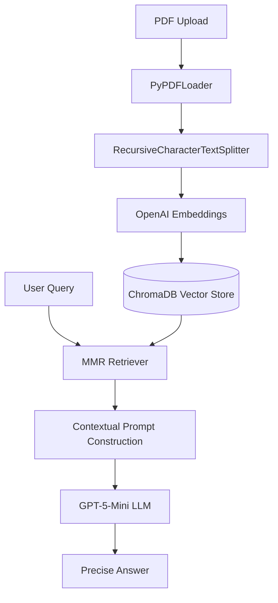
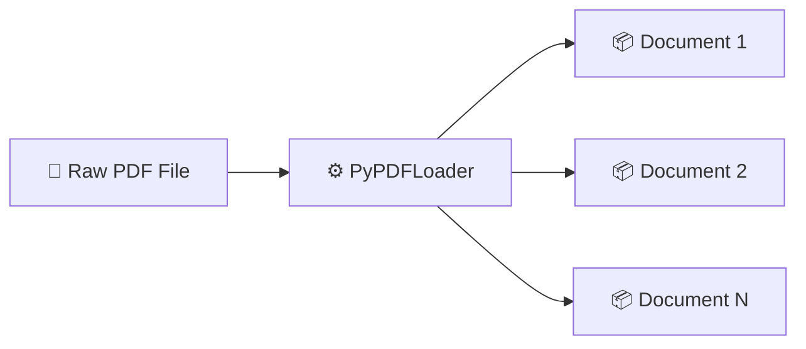
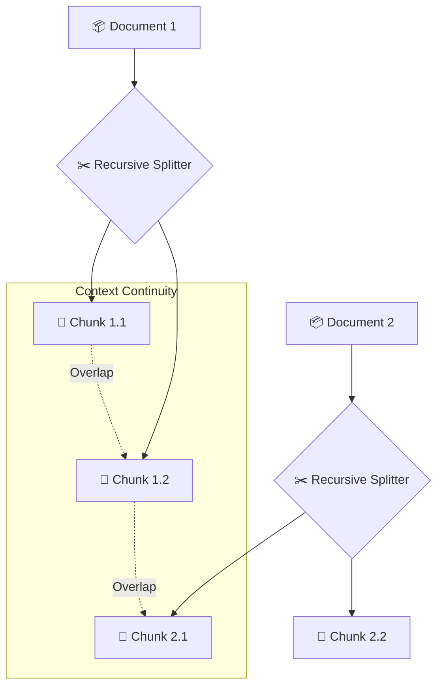
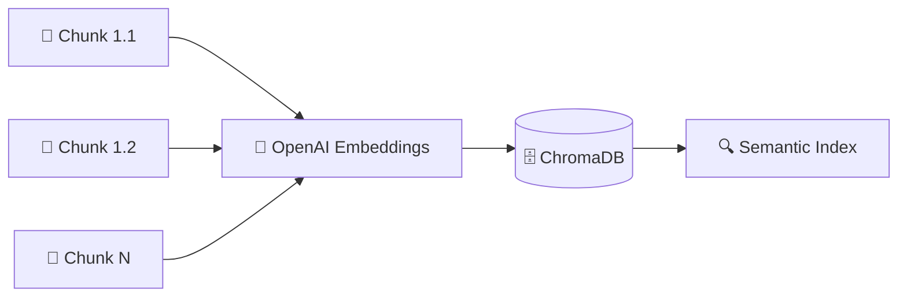
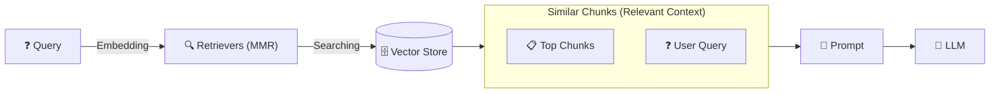

# 🧠 PDF RAG Assistant: Insight AI Engine

## 🚀 Overview
**PDF RAG Assistant** is an AI-powered document intelligence system that transforms static PDFs into interactive conversations. Instead of manually searching through hundreds of pages, users can simply upload a document and ask natural language questions to instantly receive accurate, context-aware answers.

The project is built using a modern Retrieval-Augmented Generation (RAG) architecture powered by LangChain, OpenAI Embeddings, ChromaDB, and GPT-5-Mini.

---

[](https://rag-system-hrqfklcsd2t29aysirz6vu.streamlit.app/)
[](https://www.python.org/downloads/)
[](https://langchain.com/)
[](https://opensource.org/licenses/MIT)

---

## 🔗 Live Demo
Experience the intelligence in action:
### 👉 [Launch Live Demo](https://rag-system-hrqfklcsd2t29aysirz6vu.streamlit.app/)

---

## 🏗️ The RAG Pipeline (How it Works)



---

## ⚙️ Technical Implementation Details

### 1. Document Ingestion Phase
This phase focuses on converting unstructured PDF data into a structured searchable format.
- **Library**: `langchain_community.document_loaders.PyPDFLoader`
- **Process**: The system accepts a `.pdf file`, extracts raw text content page-by-page, and converts it into a list of LangChain `Document` objects.

#### 📄 Document Object Structure
Each page of your PDF is represented as an object in a list:
```python
[
    Document(page_content="Text from Page 1...", metadata={"source": "file.pdf", "page": 0}),
    Document(page_content="Text from Page 2...", metadata={"source": "file.pdf", "page": 1}),
    # ... one object for every page
]
```

#### 🔄 Transformation Flow


### 2. Intelligent Text Segmentation (Chunking)
- **Library**: `langchain_text_splitters.RecursiveCharacterTextSplitter`
- **Process**: To fit within LLM context limits and maintain semantic meaning, we split documents into chunks. 
  - **Chunk Size**: ~1000 characters.
  - **Overlap**: ~200 characters (to ensure no context is lost at the boundaries).
  - **Why Recursive?**: It intelligently splits by paragraphs, then sentences, then words, keeping related ideas together.

#### ✂️ Chunking Visualization (Continuing from Documents)


### 3. Vectorization & Storage
- **Library**: `langchain_openai.OpenAIEmbeddings` & `langchain_community.vectorstores.Chroma`
- **Process**: Each text chunk is passed through OpenAI's embedding model to create a high-dimensional vector. These vectors are stored in **ChromaDB**, allowing for "Semantic Search" rather than simple keyword matching.

#### 🧬 Embedding & Storage Flow (Continuing from Chunks)


### 4. Advanced Retrieval (MMR)
- **Library**: `vectorstore.as_retriever(search_type="mmr")`
- **Process**: We use **Maximal Marginal Relevance (MMR)**. Unlike standard similarity search, MMR optimizes for both **relevance** (how well the chunk matches the query) and **diversity** (how unique the chunk is compared to others already selected). This prevents the AI from receiving redundant information.

#### ⚖️ MMR Retrieval & Generation Flow


### 5. Generation with Guardrails
- **Library**: `langchain_core.prompts.ChatPromptTemplate` & `init_chat_model`
- **Process**: The retrieved chunks are injected into a specialized System Prompt. The LLM (**GPT-5-Mini**) is instructed to act as a "Closed-Domain" assistant, meaning it *only* answers based on the provided PDF context.

---

## ✨ Key Features
- **Intelligent Chunking**: Uses `RecursiveCharacterTextSplitter` to maintain semantic integrity across document fragments.
- **MMR (Maximal Marginal Relevance)**: Advanced retrieval logic that balances relevance and diversity to prevent repetitive AI responses.
- **Dynamic Context Injection**: Custom-engineered system prompts that force the AI to rely strictly on document facts.
- **Premium User Experience**: A sleek, dark-themed interface with real-time feedback and chat memory.
- **Configurable Parameters**: Real-time control over chunk sizes and overlaps directly from the UI.

---

## 📂 Project Structure
```text
RAG-System/
├── app.py                      # Main Streamlit Application (The Brain)
├── main.py                     # CLI Interface for terminal testing
├── requirements.txt            # System Dependencies
├── chroma-db/                  # Persistent Vector Database Storage
├── chunking_methods/           # Research scripts for text segmentation
├── document_loader/            # PDF & Text loading utilities
├── embedding_&_storing_in_db/   # Scripts for vectorization and storage
└── retrievers/                 # Custom logic for MMR & Similarity Search
```

---

## ⚡ Quick Start

### 1. Clone & Enter
```bash
git clone https://github.com/Gunjan-Hirani-AI/RAG-System.git
cd RAG-System
```

### 2. Configure Environment
Create a `.env` file:
```env
OPENAI_API_KEY=your_api_key_here
```

### 3. Install & Launch
```bash
pip install -r requirements.txt
streamlit run app.py
```

---

## 👤 Author
**Gunjan Hirani**
- **GitHub**: [@Gunjan-Hirani-AI](https://github.com/Gunjan-Hirani-AI)
- **Role**: Solo Developer
- **Date**: May 2026

---
<p align="center">Empowering data through Conversational Intelligence</p>
